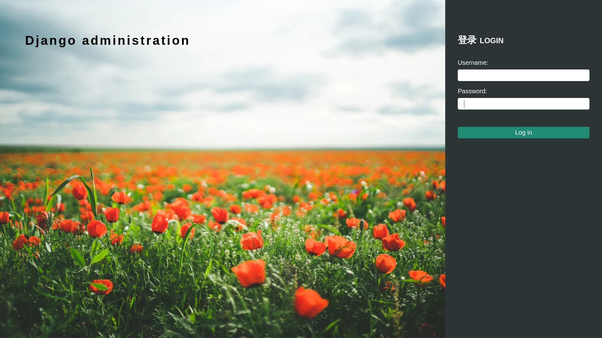

# DjangoJuss

> 一个简单的django后台模板

## Screenshots




## Quick start

1. 下载`django-juss`

```bash
$ pip install django-juss
```

2. 在`settings`中修改`INSTALLED_APPS`

```python
INSTALLED_APPS = [
    'juss',
    'django.contrib.admin',
    ...
]
```

3. 修改`MIDDLEWARE`
```python
MIDDLEWARE = [
    ...
    'juss.middlewares.LeftMenuMiddleware',
]
```

4. 添加自定义菜单(如果未设置, 则显示默认布局)

```python
JUSS_LEFT_MENU = [
    {'label':'仪表板', 'children':[
        {'label':'首页', 'path':'/admin/'},
    ]},
    {'label':'认证和授权', 'children':[
        {'model':'account.user'},
        {'model':'account.group'},
    ]}
]

```

## 内置Widgets

1. RichTextWidget

使用`tinymce`的富文本编辑

2. JFileInputWidget

扩展默认的FileInput, 增加缩略图展示

3. JMSelectWidget

扩展默认的FilePathField, 增加可视化图片选择
